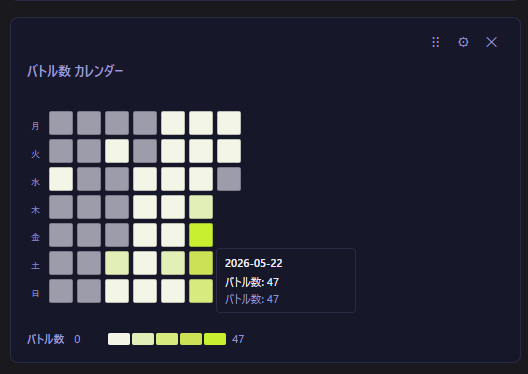

# チャートゥーン (chartoon)

Nintendo アカウントから [nxapi](https://github.com/samuelthomas2774/nxapi) が解析した非公式 API 経由で Splatoon 3 のバトル履歴を取得し、グラフで可視化する OSS の PC アプリです。任天堂株式会社とは無関係です。

バグ報告・機能要望・感想など、フィードバックは[フィードバックフォーム](https://docs.google.com/forms/d/e/1FAIpQLScAP6LH9JDHaJGs4c7UJakF-YNU1UJRN10H4uSePqiknN-apQ/viewform)からお気軽にどうぞ（匿名可）。

🌐 **ダウンロードページ**: https://chartoon.pages.dev/

```
chartoon/
└── app/         # Tauri アプリ本体（Vite + React + recharts + Rust）
    ├── src/         # フロントエンド（React + TypeScript）
    └── src-tauri/   # Rust バックエンド（Tauri + SQLite）
```

## 機能

- **ダッシュボード** — 武器別・モード別・ステージ別の勝率をグラフで表示
- **バトルログ** — バトル履歴を一覧表示（ページング対応）。詳細モーダルでチーム編成・ギア・ランク / X パワー変動を確認できます
- **武器図鑑** — 所持武器の勝率・サブ/スペシャル一覧
- **stat.ink 自動アップロード** — 取得したバトルを [stat.ink](https://stat.ink/) へ自動アップロード（API キー登録時）。同一バトルは s3s と同じ UUID v5 名前空間で重複排除されます
- **AI 分析** — 自然言語でグラフを生成（OpenAI / Google Gemini / Anthropic Claude / xAI Grok 対応）
- **自動取得** — 15 分〜24 時間ごとの定期間隔でバトルデータをバックグラウンドで取得。有効時はウィンドウを閉じてもトレイに常駐し、完了をシステム通知でお知らせ

## スクリーンショット

<table>
  <tr>
    <th>ダッシュボード</th>
    <th>カレンダーヒートマップ</th>
    <th>散布図</th>
  </tr>
  <tr>
    <td></td>
    <td></td>
    <td></td>
  </tr>
  <tr valign="top">
    <td>ダッシュボードでバトル結果を分析</td>
    <td>カレンダー形式で可視化</td>
    <td>散布図などチャートをカスタマイズ</td>
  </tr>
</table>

## 必要なもの

| ツール          | 用途                          |
| ------------ | ----------------------------- |
| Node.js 20+  | アプリ開発・ビルド              |
| Rust + Cargo | Tauri デスクトップアプリのビルド |

Windows / macOS / Linux 対応（WSL 不要）。
動作確認済みは macOS・Windows。Linux は未検証。

---

## アプリ起動（開発）

**初回セットアップ（nxapi-sidecar のビルドが必要）:**

```bash
# nxapi-sidecar をビルド（初回のみ）
cd tools/nxapi-wrapper
npm install
./build.sh mac-arm    # macOS Apple Silicon
# ./build.sh mac-x64  # macOS Intel
# build.bat           # Windows
cd ../..

# アプリ起動
cd app
npm install
npx tauri dev      # 初回は Rust のコンパイルで数分かかります
```

> **macOS の注意**: `tauri dev` では Nintendo ログインの deep-link（`npf71b963c1b7b6d119://`）が正常に処理されない場合があります。ログイン機能を含む動作確認は `npx tauri build` でビルドした `.app` を使ってください。

## ローカルビルド（インストーラー生成）

```bash
cd app
npx tauri build    # インストーラーを生成（初回は Rust のフルビルドで数分かかります）
```

生成物は `app/src-tauri/target/release/bundle/` に出力されます（Windows: `.msi` / `.exe`、macOS: `.dmg`）。

---

## 技術メモ

### SplatNet 3 とは

**SplatNet 3** は、Nintendo Switch Online スマートフォンアプリが内部で使用している任天堂のサービスです。バトル履歴・ギア情報などを取得できる GraphQL API を持ちますが、公式には公開されていません。

[**nxapi**](https://github.com/samuelthomas2774/nxapi)（Samuel Thomas 氏が開発する OSS）は、このフローを解析し、サードパーティ製ツールから SplatNet 3 へアクセスする方法を明らかにしました。chartoon の認証実装はこの nxapi のフローを Rust で再実装したものです。

### 認証

Nintendo Switch Online (NSO) OAuth2 (PKCE) フローを Rust で実装（`src-tauri/src/auth.rs`）。nxapi が明らかにした認証フローに基づいています。f-token の生成には nxapi が内部で使用する `nxapi-znca-api.fancy.org.uk` エンドポイントを使用。

認証フロー（nxapi が解析したフロー）:
```
Nintendo Account ログインURL → ブラウザで開く（deep-link で認可コードを受け取る）
→ session_token（長期保存）
→ id_token → f-token (nxapi-znca-api) → Coral login → gtoken
→ bulletToken（SplatNet3 アクセス用、約2時間有効）
```

### データ保存

バトルデータは SQLite（`chartoon.db`）に保存されます。
主要フィールド（モード・武器・ステージ・K/D/A・塗りポイント等）は個別カラムで保持し、レスポンス全体は `raw_json` カラムに格納します。

### AI 分析

OpenAI / Google Gemini / Anthropic Claude / xAI Grok のいずれかに集計データを渡し、recharts で描画できる JSON（`ChartSpec`）を生成します。プロバイダごとに価格情報付きのモデルプリセットを用意しています（`app/src/utils/aiModels.ts`）。API キーは `localStorage` に保存されます。

### stat.ink アップロード

[**stat.ink**](https://stat.ink/) は Splatoon 3 のバトル統計を共有・分析する OSS プラットフォームです。chartoon は設定で API キーを登録すると、取得したバトルを `stat.ink/api/v3/battle` へ自動アップロードできます。

ペイロード構築は [**s3s**](https://github.com/frozenpandaman/s3s)（frozenpandaman 氏が開発する Python 製のサードパーティツール）の `prepare_battle_result` / `set_scoreboard` 相当を Rust で再実装したものです（`src-tauri/src/statink.rs`）。バトル ID から UUID v5 を生成する際の名前空間も s3s と一致させており、同じバトルを別ツールから送信しても stat.ink 側で重複排除されます。武器・ステージの ID 変換ルールも s3s 由来です。

- 送信先: `https://stat.ink/api/v3/battle`
- 送信内容: バトル結果（モード・ルール・ステージ・K/D/A・塗り）、両チームのプレイヤー武器・ギアパワー、ウデマエ / X パワーの履歴（バンカラチャレンジ・X マッチ評価戦の最終バトルのみ）
- API キー: ローカル（AppData）にのみ保存。stat.ink の [API トークン発行ページ](https://stat.ink/profile) から取得
- 送信トリガー: 設定で「自動アップロード」を ON にしたとき、バトルデータ取得後に未送信ぶんを送信

---

## 注意事項

- 本ツールは個人の利用を目的としています。
- SplatNet 3 は任天堂が公式に公開している API ではありません。任天堂側の仕様変更により、予告なく動作しなくなる可能性があります。
- 認証情報はアプリの AppData ディレクトリにのみ保存されます（Windows: `%APPDATA%\com.chartoon.app\`、macOS: `~/Library/Application Support/com.chartoon.app/`）。コミットしないでください。
- アプリの UI は現状日本語のみです。

## プライバシーポリシー

本ツールが収集・使用する情報は以下の通りです。

### 収集する情報

- **Nintendo アカウントのセッショントークン（session_token）**
  - ローカルの AppData ディレクトリにのみ保存されます。
  - 外部サーバーへ送信・アップロードすることはありません。
- **バトル履歴データ**
  - SplatNet 3 から取得したバトルデータはローカルの SQLite DB にのみ保存されます。

### 外部サービスへの送信

- **nxapi-znca-api（`nxapi-znca-api.fancy.org.uk`）**: Nintendo 認証フローで必要な f-token を生成するため、nxapi の内部処理として `id_token` がこのエンドポイントへ送信されます。これは nxapi の仕様に基づくものであり、chartoon 独自の送信ではありません。詳細は [nxapi](https://github.com/samuelthomas2774/nxapi) を参照してください。
- **stat.ink（`stat.ink/api/v3/battle`）**: 設定で API キーを登録し自動アップロードを有効にした場合のみ、バトル取得後に未送信ぶんが送信されます。送信内容はバトル結果・両チームのプレイヤー武器・ギアパワー・ウデマエ / X パワー履歴です。API キーはローカル（AppData）にのみ保存され、stat.ink 以外には送信されません。設定を OFF にすれば送信は行われません。
- **AI 分析 API（OpenAI / Gemini / Anthropic / Grok）**: AI 分析機能を使用する場合、バトル集計データ（個人を特定できないサマリー統計）が選択したプロバイダのリクエストに含まれます。設定した API キーはローカル（`localStorage`）にのみ保存され、選択したプロバイダ以外には送信されません。
- 上記以外に、本ツールが独自に情報を外部送信することはありません。

### 個人情報の収集について

本ツールは、氏名・メールアドレス・位置情報などの個人情報を収集・記録・送信しません。

## 参考リポジトリ

Nintendo Switch Online 認証・SplatNet 3 API アクセス・stat.ink 連携の実装に際して以下を参照しました。

- [samuelthomas2774/nxapi](https://github.com/samuelthomas2774/nxapi) — Nintendo Switch Online の認証・API アクセスライブラリ。chartoon の認証フローはこのプロジェクトが明らかにした仕様に基づいています。f-token 生成も nxapi が内部で使用するエンドポイント（`nxapi-znca-api.fancy.org.uk`）を利用します。
- [fetus-hina/stat.ink](https://github.com/fetus-hina/stat.ink) — AIZU 氏が運営する Splatoon シリーズのバトル統計共有プラットフォーム（[stat.ink](https://stat.ink/)）の OSS 実装。chartoon の stat.ink アップロード機能はこのサービスの公開 API（`api/v3/battle`）を利用します。
- [frozenpandaman/s3s](https://github.com/frozenpandaman/s3s) — SplatNet 3 から stat.ink へバトルデータを送る Python 製ツール。chartoon の stat.ink アップロード機能はこのリポジトリのペイロード構築ロジック（`prepare_battle_result` / `set_scoreboard` 相当）・UUID v5 名前空間・武器/ステージ ID 変換ルールを Rust で再実装したものです。

## 免責事項

本ソフトウェアは MIT License の下で無保証で提供されます。詳細は `LICENSE` を参照してください。

This project is not affiliated with or endorsed by Nintendo. "Splatoon" is a trademark of Nintendo Co., Ltd.

## 関連リポジトリ

- [geartoon](https://github.com/hiroshiyokoya/geartoon) — Splatoon 3 ギア検索・構成共有アプリ（Tauri + React）

## License

[MIT](LICENSE)
