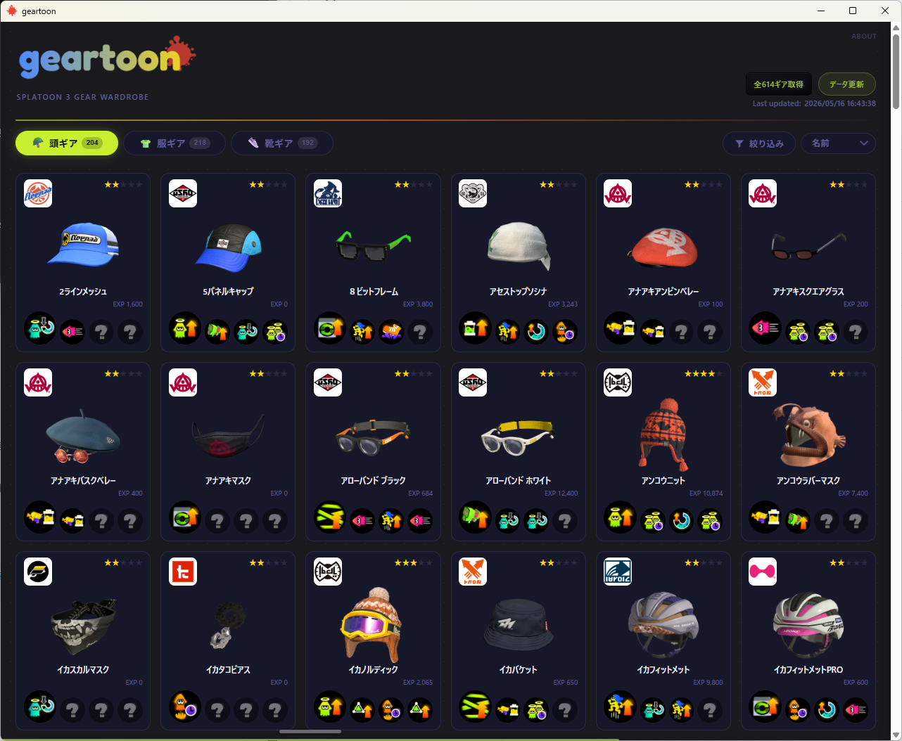
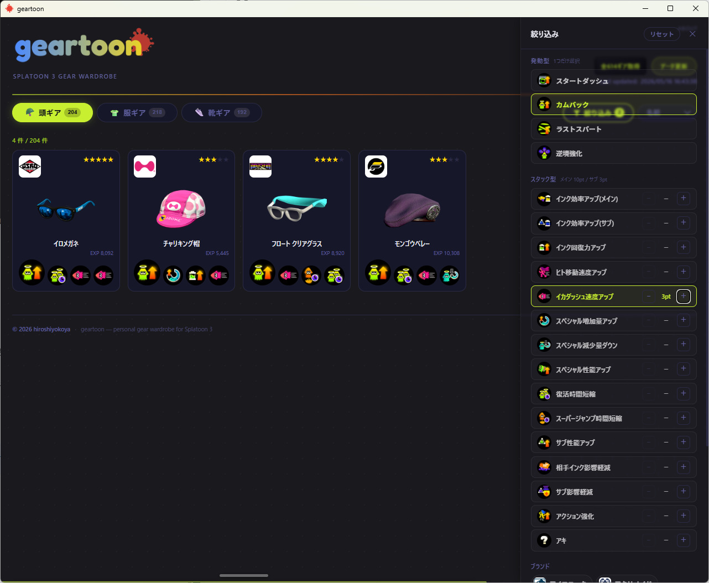
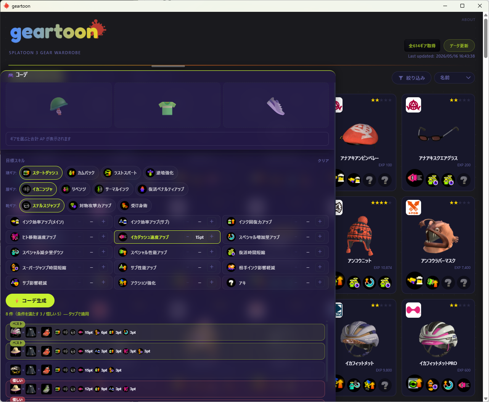

# ギアトゥーン (geartoon)

Nintendo アカウントで認証し、非公式 API 経由で Splatoon 3 の所持ギアを取得・表示する非公式ファンツールです。任天堂株式会社とは無関係で、データ取得に [nxapi](https://github.com/samuelthomas2774/nxapi) を使用しています。

バグ報告・機能要望・感想など、フィードバックは [GitHub Discussions](https://github.com/hiroshiyokoya/geartoon/discussions) でお気軽にどうぞ。

```
geartoon/
├── tools/   # nxapi サイドカーのビルド環境（Node.js）
└── app/     # ギア表示 UI（Vite + React + Tauri）
```

## スクリーンショット

| ギア一覧 | 絞り込み | コーデ生成 |
|---|---|---|
|  |  |  |
| 所有ギアを頭・服・靴ごとに一覧表示 | スキル、ブランドで、ギアを絞り込み | 目標スキルからコーデ候補を自動生成 |

## 関連リポジトリ

- [geartoon-viewer](https://github.com/hiroshiyokoya/geartoon-viewer) — Android ビューワー（Kotlin + Jetpack Compose）

## 必要なもの

| ツール          | 用途                       |
| ------------ | -------------------------- |
| Node.js 20+  | アプリ開発・ビルド               |
| Rust + Cargo | Tauri デスクトップアプリのビルド     |

Windows / macOS / Linux 対応（WSL 不要）。
動作確認済みは Windows と macOS。Linux は未検証。

---

## tools/ — データパイプライン

Samuel Thomas 氏が開発する OSS である [nxapi](https://github.com/samuelthomas2774/nxapi)（任天堂非公式）を用いて、SplatNet 3 から所持ギア情報を取得します。

nxapi は Tauri サイドカーとしてアプリに同梱されており、**アプリ内の「データ更新」ボタンから直接データを取得できます**（Docker 不要）。

### ギアパワー（AP）

ギアパワーは **57 点法**で数えます（1 着あたりメイン 10 + サブ 3×3 = 19AP、頭・服・靴で最大 57AP）。アプリの絞り込みおよびコーデ生成はこの前提に合わせています。

### gear_db のフォーマット

アプリが取得したデータは AES-256-GCM で暗号化され `gear_db.bin` として保存されます（`gear_db.json` はそのまま残りません）。スキーマは以下の通りです：

```json
{
  "head":     [ { "id", "name", "rarity", "brand", "image", "primary_skill", "additional_skills", "exp" }, ... ],
  "clothing": [ ... ],
  "shoes":    [ ... ]
}
```

画像ファイルは XOR スクランブルされ `.gti` 形式で保存されます。ビューワーアプリ（Android）はデスクトップアプリと同じキー・アルゴリズムで復号できます。

---

## app/ — Web UI

所持ギアの一覧・絞り込み・スキル構成生成を GUI で操作できるアプリです。表示用データはアプリ内の「データ更新」で取得・生成されます（AppData に `gear_db.bin` と画像が保存されます）。

### 機能

- ギア一覧（頭 / 服 / 靴タブ切り替え）
- 並び替え（ブランド / ギアパワー / 名前 / レア度 / ケイケン値）
- 絞り込みドロワー（右スライド、すりガラス風半透明UI）
  - **発動型**: タブ対応スキルをシングルセレクト（カムバック・ステルスジャンプ等）
  - **スタック型**: 最低 pt をステッパーで指定
  - **ブランド**: マルチセレクト
- **コーデ機能**（画面下部ボトムシート、ドラッグで開閉）
  - 頭 / 服 / 靴ギアをそれぞれ選択してスロットにセット
  - 選択ギアの合計 AP を自動集計・表示
  - 目標スキルを指定してコーデ生成（AP プール制約を考慮した候補探索）
    - 発動型スキル（メインスロット専用）の選択数に応じて、スタック型の割り当て可能 AP が自動調整される
    - 達成可能な AP 値のみステッパーで選択できる（`stepUp` / `stepDown` が `aAvail` を考慮）
  - 候補リストからワンタップでスロットに適用
- デザイントークン管理（`index.css` の `:root` にぼかし・透明度・レイアウト値を集約）
  - カラーテーマを設定画面から切り替え可能（Purple / Solarized Light / Solarized Dark）
  - 表示密度・コーデ候補件数・惜しい候補の上限を設定画面から変更可能（設定は `localStorage` に保持）

### アプリ起動（Tauri）

```bash
cd app
npm install        # 初回のみ
npx tauri dev      # アプリ起動（初回はRustのコンパイルで数分かかります）
```

### サイドカーのビルド（wrapper.js を変更した場合）

`tools/nxapi-wrapper/wrapper.js` を変更したときは、ローカルビルド前に再ビルドが必要です。

```bash
cd tools/nxapi-wrapper
npm run build:win      # Windows
npm run build:mac-arm  # macOS (Apple Silicon)
npm run build:linux    # Linux
```

> CI（GitHub Actions）ではリリース時に自動ビルドされます。

### ローカルビルド（インストーラー生成）

```bash
cd app
npx tauri build    # インストーラーを生成（初回はRustのフルビルドで数分かかります）
```

生成物は `app/src-tauri/target/release/bundle/` に出力されます（Windows: `.msi` / `.exe`、macOS: `.dmg`）。

### Web のみで起動（Tauri なし・データ更新不可）

```bash
cd app
npm install
npm run dev
```

---

## 参考リポジトリ

Nintendo Switch Online 認証・SplatNet 3 API アクセスの実装に際して以下を参照しました。

- [samuelthomas2774/nxapi](https://github.com/samuelthomas2774/nxapi) — Nintendo Switch Online の認証・API アクセスライブラリ。本プロジェクトの認証基盤として使用。
- [misenhower/splatoon3.ink](https://github.com/misenhower/splatoon3.ink) — nxapi + Docker による SplatNet 3 データ取得の実装例として参照。
- [imink-app/f-API](https://github.com/imink-app/f-API) — Nintendo 認証に必要な f-token 生成 API。nxapi はかつてこの API を使用していたが、現在は独自エンドポイント（nxapi-znca-api）へ移行済み。

## 技術メモ

- **nxapi バージョン**: `1.6.1-next.254`（プレリリース）を使用。安定版では f-token 生成エンドポイント（nxapi-znca-api）への認証ができないため。
- **`nxapi-remote-config.json`**: Nintendo が Coral 3.3.0 に更新したことで、公式の live remote-config が `coral: null` となり認証をブロックするようになった。そのためパッチ済み設定を nxapi サイドカーに同梱している。
- **f-token 生成**: nxapi が内部で使用する `nxapi-znca-api.fancy.org.uk` エンドポイントで生成。かつて使用されていた imink API（`api.imink.app`）は現在サービスが停止している。
- **所有ギア取得**: nxapi CLI に直接のコマンドはないため、`MyOutfitCommonDataEquipmentsQuery` を Node.js スクリプトから直接呼び出している。
- **Tauri 認証実装**: Nintendo OAuth (PKCE) は Rust で実装（`app/src-tauri/src/auth.rs`）。f-token 生成は nxapi サイドカー経由で行う（Issue [#39](https://github.com/hiroshiyokoya/geartoon/issues/39) 実装済み）。

## 注意事項

- 本ツールは個人の利用を目的としています。
- SplatNet 3 は任天堂が公式に公開している API ではありません。任天堂側の仕様変更により、予告なく動作しなくなる可能性があります。
- SplatNet 3 からダウンロードされるギア・スキル画像の著作権は任天堂株式会社に帰属します。これらの画像は個人利用の範囲内でのみ使用し、再配布・商用利用・二次創作物への無断使用は行わないでください。
- 認証情報ファイルはアプリの AppData ディレクトリ（Windows: `%APPDATA%\com.geartoon.app\`、macOS: `~/Library/Application Support/com.geartoon.app/`）にのみ保存されます。コミットしないでください。
- 認証に使用する Nintendo アカウントの情報はローカルにのみ保存されます。外部サーバーへの送信は nxapi の仕様に準じます。
- アプリのUIは、現状日本語のみです。

## プライバシーポリシー

本ツールが収集・使用する情報は以下の通りです。

### 収集する情報

- **Nintendo アカウントのセッショントークン（session_token）および各種アクセストークン**
  - ローカルの AppData ディレクトリ（`com.geartoon.app/nxapi/`）にのみ保存されます。
  - 外部サーバーへ送信・アップロードすることはありません。

### 外部サービスへの送信

- **nxapi-znca-api（`nxapi-znca-api.fancy.org.uk`）**：Nintendo 認証フローで必要な f-token を生成するため、nxapi の内部処理として `id_token` がこのエンドポイントへ送信されます。これは nxapi の仕様に基づくものであり、geartoon 独自の送信ではありません。詳細は [nxapi](https://github.com/samuelthomas2774/nxapi) を参照してください。
- 上記以外に、本ツールが独自に情報を外部送信することはありません。

### 個人情報の収集について

本ツールは、氏名・メールアドレス・位置情報などの個人情報を収集・記録・送信しません。

## 免責事項

本ソフトウェアは MIT License の下で無保証で提供されます。詳細は `LICENSE` を参照してください。

This project is not affiliated with or endorsed by Nintendo. "Splatoon" is a trademark of Nintendo Co., Ltd.

## License

[MIT](LICENSE)
