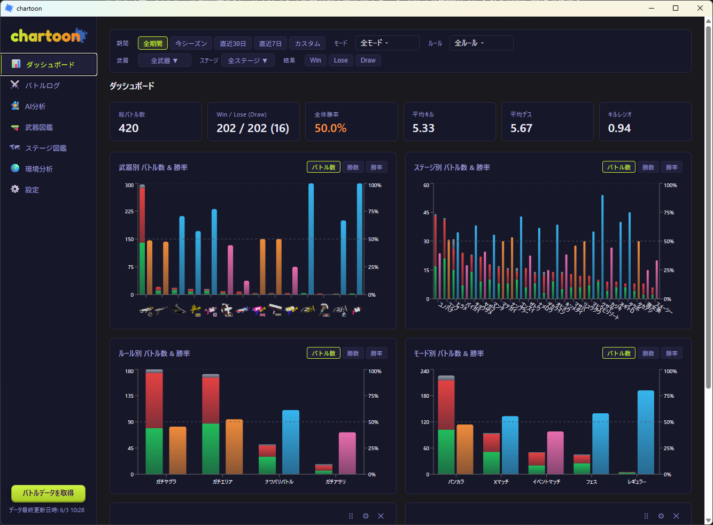
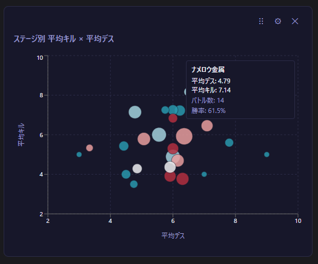
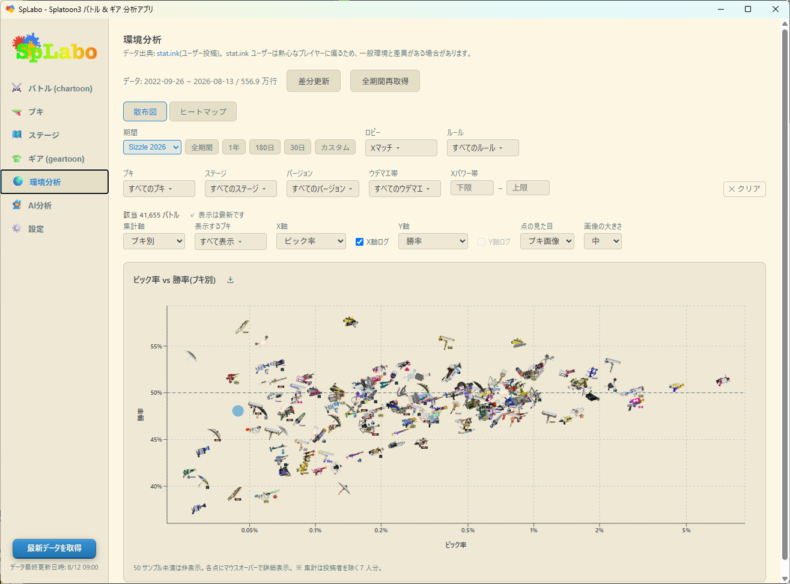

# スプラボ (splabo)

Nintendo アカウントから [nxapi](https://github.com/samuelthomas2774/nxapi) が解析した非公式 API 経由で Splatoon 3 のバトル履歴・所持ギアを取得し、可視化・分析する OSS の PC アプリです。任天堂株式会社とは無関係です。

> ## 📢 chartoon は splabo になりました
>
> - 戦績可視化・分析アプリ **chartoon** はギア管理アプリ **geartoon** と統合し、名称を **splabo** に、1 バイナリ（識別子 `com.splabo.app`）に変更しました。
> - **「ギア」タブ**で所持ギアの取得・閲覧・コーデ（ギア構成）組みができます（旧 geartoon の機能を統合）。
> - **設定・戦績データ・ギアデータはそのまま引き継がれます**。旧 `com.chartoon.app` / `com.geartoon.app` のデータは splabo 初回起動時に**非破壊コピー**で自動移行されます（`app/src-tauri/src/migration.rs`）。

バグ報告・機能要望・感想など、フィードバックは[フィードバックフォーム](https://docs.google.com/forms/d/e/1FAIpQLSd2m8eNn4HwTjOY1PMnecJvSH95QCJxNi0Lyy1w4zxhIdndrQ/viewform)からお気軽にどうぞ（匿名可）。

🌐 **ダウンロードページ**: https://chartoon.pages.dev/

```
splabo/
├─ app/          # Tauri アプリ本体（Vite + React + recharts + Rust/SQLite）
│  ├─ src/       #   フロント（戦績 components/ ＋ ギア gear/・.gear-root スコープ）
│  └─ src-tauri/ #   Rust（auth / statink / gear.rs / gear_crypto.rs / migration.rs / companion.rs / battle_export.rs + SQLite）
├─ tools/        # nxapi サイドカーのビルド環境（nxapi-wrapper）
├─ docs/         # GitHub Pages（chartoon.pages.dev）
├─ .github/      # CI（ci.yml）+ リリース（splabo-release.yml）
├─ package.json  # npm workspaces（app）
└─ Cargo.toml    # Cargo workspace + [workspace.dependencies]
```

関連（本リポジトリ外・別管理）:
- [splabo-viewer](https://github.com/hiroshiyokoya/splabo-viewer)（旧 geartoon-viewer） — splabo のモバイル・コンパニオン（Android / Kotlin + Jetpack Compose）。同一 LAN の splabo デスクトップとペアリングし、ギア・直近バトルを持ち出して閲覧します。splabo が出力する暗号化データの契約（gear-export-v1 / battle-export-v1）と共有フィクスチャのみを介して連携し、コードは統合しません。

## 機能

- **戦績** — タブ内で「ダッシュボード」と「一覧」を切り替えられます
  - ダッシュボード: 武器別・ロビー別・ステージ別の勝率をグラフで表示。バトル数カレンダー（月の 1 日から新しい列が始まります）やカスタムグラフも
  - 一覧: バトル履歴を一覧表示（ページング対応）。詳細モーダルでチーム編成・ギア・ランク / X パワー変動を確認できます
- **武器図鑑** — 「パネル」と「一覧」を切り替え可能。一覧は列見出しのクリックで並び替えでき、カテゴリ / サブ / スペシャルで絞り込めます。詳細では「よく戦うステージ」「勝率の良いステージ」やルール別勝率を確認できます
- **ステージ図鑑** — 「パネル」と「一覧」を切り替え可能。ステージ別の勝率・バトル数・平均キル / デス・K/D・KO 率などを表示
- **ギアコーデ** — 所持ギアを取得して一覧表示。ギアパワーを組み合わせてコーデ（ギア構成）を組めます（旧 geartoon の機能を統合）
- **環境分析** — [stat.ink](https://stat.ink/) の公開バトルデータ（全世界のプレイヤー投稿）を取り込み、武器ピック率・勝率などコミュニティ全体の環境を散布図・マトリクスヒートマップで分析。期間・ロビー・ルール・武器（カテゴリ見出しで一括選択）・ステージ・バージョン・ウデマエ帯（全期間 / 今シーズン / 1年 / 180日 / 30日 / カスタム）で絞り込み可能。条件に合う該当バトル数も表示します。集計は stat.ink の全体統計と同じく、投稿者本人を除いた 7 人を母数にします
- **stat.ink 自動アップロード** — 取得したバトルを [stat.ink](https://stat.ink/) へ自動アップロード（API キー登録時）。同一バトルは s3s と同じ UUID v5 名前空間で重複排除されます
- **パネルの保存** — ダッシュボードと環境分析の各パネルを **PNG** または **HTML** として保存できます。保存ボタンはパネル右上。画像／HTML にはタイトル・絞り込み条件・splabo ロゴ・クレジットが入り、PNG では角丸の外側は透明です。HTML はブラウザで開いて散布図のツールチップをホバー確認できます
- **AI 分析** — 自然言語で質問すると SQL を生成し、**この PC の中だけで集計**して表で表示（OpenAI / Google Gemini / Anthropic Claude / xAI Grok 対応）
- **自動取得** — 15 分〜24 時間ごとの定期間隔でバトルデータをバックグラウンドで取得し、続けてギアも更新します（ギア失敗でもバトル取得の成功は維持）。有効時はウィンドウを閉じてもトレイに常駐し、完了をシステム通知でお知らせ

> **絞り込みについて**: 武器図鑑・ステージ図鑑も上部の絞り込み（期間・ロビー・ルール・結果）に対応しています。ただし熟練度・通算勝利数・総塗ポイントは任天堂から取得する累計値のため、絞り込みを変えても全期間の値のままです（「全期間」バッジで区別しています）。

## スクリーンショット

<table>
  <tr>
    <th>ダッシュボード</th>
    <th>カスタムグラフ</th>
    <th>環境分析</th>
  </tr>
  <tr>
    <td></td>
    <td></td>
    <td></td>
  </tr>
  <tr valign="top">
    <td>ダッシュボードでバトル結果を分析</td>
    <td>散布図などチャートをカスタマイズ</td>
    <td>stat.ink の公開データで環境を分析</td>
  </tr>
</table>

## 必要なもの

| ツール          | 用途                          |
| ------------ | ----------------------------- |
| Node.js 20+  | アプリ開発・ビルド              |
| Rust + Cargo | Tauri デスクトップアプリのビルド |

Windows / macOS / Linux 対応（WSL 不要）。
動作確認済みは macOS・Windows。Linux は未検証。

---

## ビルド

npm workspaces + Cargo workspace 構成です。フロントエンド依存は**ルートで一括インストール**します。

```bash
# 依存インストール（ルートで workspace 全体）
npm ci

# フロントエンド（tsc 型チェック + vite build）
npm run build -w app

# Rust（workspace 全体の型チェック）
cargo check
```

### サイドカー（nxapi-wrapper）

Tauri バックエンドは `app/src-tauri/binaries/nxapi-sidecar` を externalBin として要求します。ローカルビルドやリリース前にはサイドカーをビルドしてください（プラットフォーム別スクリプト: `build:win` / `build:mac-arm` / `build:linux`）。

```bash
cd tools/nxapi-wrapper
npm install
./build.sh mac-arm    # macOS Apple Silicon
# ./build.sh mac-x64  # macOS Intel
# build.bat           # Windows
```

### 開発起動

```bash
npm ci                     # リポジトリルートで workspace 全体を一度だけ
npm run tauri dev -w app   # 初回は Rust のコンパイルで数分かかります
```

> **macOS の注意**: `tauri dev` では Nintendo ログインの deep-link（`npf71b963c1b7b6d119://`）が正常に処理されない場合があります。ログイン機能を含む動作確認は `npx tauri build` でビルドした `.app` を使ってください。

## ローカルビルド（インストーラー生成）

```bash
cd app
npx tauri build    # インストーラーを生成（初回は Rust のフルビルドで数分かかります）
```

生成物は `app/src-tauri/target/release/bundle/` に出力されます（Windows: `.msi` / `.exe`、macOS: `.dmg`）。

## リリース

単一 `splabo-vX.Y.Z` タグを push すると `.github/workflows/splabo-release.yml` がドラフトリリースを作成します（Windows `.exe` / `.msi`・macOS `.dmg`）。CHANGELOG は [`CHANGELOG.md`](CHANGELOG.md) で継続します。旧 per-app タグ（`chartoon-v*` / `geartoon-v*`）および monorepo 化以前の `vX.Y.Z` は凍結扱いで、ワークフローのトリガーからは外しています。

---

## 技術メモ

### SplatNet 3 とは

**SplatNet 3** は、Nintendo Switch Online スマートフォンアプリが内部で使用している任天堂のサービスです。バトル履歴・ギア情報などを取得できる GraphQL API を持ちますが、公式には公開されていません。

[**nxapi**](https://github.com/samuelthomas2774/nxapi)（samuelthomas2774 氏が開発する OSS）は、このフローを解析し、サードパーティ製ツールから SplatNet 3 へアクセスする方法を明らかにしました。splabo の認証実装はこの nxapi のフローを Rust で再実装したものです。

### 認証

Nintendo Switch Online (NSO) OAuth2 (PKCE) フローを Rust で実装（`app/src-tauri/src/auth.rs`）。nxapi が明らかにした認証フローに基づいています。f-token の生成には nxapi が内部で使用する `nxapi-znca-api.fancy.org.uk` エンドポイントを使用。

認証フロー（nxapi が解析したフロー）:
```
Nintendo Account ログインURL → ブラウザで開く（deep-link で認可コードを受け取る）
→ session_token（長期保存）
→ id_token → f-token (nxapi-znca-api) → Coral login → gtoken
→ bulletToken（SplatNet3 アクセス用、約2時間有効）
```

### データ保存

バトルデータは SQLite（`chartoon.db`）に保存されます。
主要フィールド（モード・武器・ステージ・K/D/A・塗りポイント等）は個別カラムで保持し、レスポンス全体は `raw_json` カラムに格納します。所持ギアは暗号化 JSON（gear-export-v1）で保持します。

### AI 分析

OpenAI / Google Gemini / Anthropic Claude / xAI Grok のいずれかに、**質問文とデータ構造の説明だけ**を渡し、返ってきた SQLite の SELECT をアプリが手元で実行します。バトルデータそのものは AI に送りません。表示は「AI の説明」「実行した SQL」「結果の表」です。プロバイダごとに価格情報付きのモデルプリセットを用意しています（`app/src/utils/aiModels.ts`）。API キーは `localStorage` に保存されます。

読み取り専用・タイムアウト・行数上限で安全に実行します。結果をグラフにする機能は次の段で入れる予定です（現状は表のみ）。

### stat.ink アップロード

[**stat.ink**](https://stat.ink/) は Splatoon 3 のバトル統計を共有・分析する OSS プラットフォームです。splabo は設定で API キーを登録すると、取得したバトルを `stat.ink/api/v3/battle` へ自動アップロードできます。

ペイロード構築は [**s3s**](https://github.com/frozenpandaman/s3s)（frozenpandaman 氏が開発する Python 製のサードパーティツール）の `prepare_battle_result` / `set_scoreboard` 相当を Rust で再実装したものです（`app/src-tauri/src/statink.rs`）。バトル ID から UUID v5 を生成する際の名前空間も s3s と一致させており、同じバトルを別ツールから送信しても stat.ink 側で重複排除されます。武器・ステージの ID 変換ルールも s3s 由来です。

- 送信先: `https://stat.ink/api/v3/battle`
- 送信内容: バトル結果（モード・ルール・ステージ・K/D/A・塗り）、両チームのプレイヤー武器・ギアパワー、ウデマエ / X パワーの履歴（バンカラチャレンジ・X マッチ評価戦の最終バトルのみ）
- API キー: ローカル（AppData）にのみ保存。stat.ink の [API トークン発行ページ](https://stat.ink/profile) から取得
- 送信トリガー: 設定で「自動アップロード」を ON にしたとき、バトルデータ取得後に未送信ぶんを送信

---

## 注意事項

- 本ツールは個人の利用を目的としています。
- SplatNet 3 は任天堂が公式に公開している API ではありません。任天堂側の仕様変更により、予告なく動作しなくなる可能性があります。
- 認証情報はアプリの AppData ディレクトリにのみ保存されます（Windows: `%APPDATA%\com.splabo.app\`、macOS: `~/Library/Application Support/com.splabo.app/`）。旧 chartoon / geartoon からのデータは初回起動時に非破壊コピーで移行されます。コミットしないでください。
- アプリの UI は現状日本語のみです。

## モバイル同期がつながらないとき

同じネットワーク（Wi-Fi ルーターや有線 LAN）なのにスマホアプリ「SpLabo viewer」（[splabo-viewer](https://github.com/hiroshiyokoya/splabo-viewer)）から QR を読んでもつながらない場合、多くは **Windows のファイアウォール / ネットワークプロファイル**が原因です。

- **ネットワークプロファイルが「パブリック」になっている**
  Windows はパブリック プロファイルのとき受信接続を既定で全ブロックします。この状態だと同じネットワークでもスマホからデスクトップへ到達できません。
  **対処**: 「設定 → ネットワークとインターネット → 現在の接続 → ネットワーク プロファイルの種類」を **「プライベート ネットワーク」** に変更してください。設定タブでモバイル同期を有効にすると、パブリックのときはアプリ内にも警告を表示します。
- **🔴 ネットワークプロファイルを「あとから」変更した**
  **これが最もハマりやすいパターンです。** Windows の受信許可規則は**プロファイルごと**に効きます。パブリックのときに許可した規則は、**プライベートに変更しても引き継がれません**。つまり上の手順でプライベートに変更した直後は「プロファイルはプライベート・許可規則はパブリック用だけ」という状態になり、**アプリ内の警告も出ないまま受信がブロックされ続けます**。
  **確認・対処**:
  1. Win+R で `wf.msc` を実行（Windows Defender ファイアウォールの詳細設定）
  2. 左ペインの **受信の規則** から `splabo` を探す
  3. 規則を右クリック → **プロパティ** → **詳細設定**タブ → **プロファイル**で、いま使っているプロファイル（通常は**プライベート**）にチェックが入っているか確認し、入っていなければチェックする
  4. **⚠ splabo の規則が複数ある場合は、そのすべてに対して同じ確認をしてください。** 通常 TCP / UDP の 2 つが作られるため、片方だけ直すと中途半端な状態のままつながりません
  また、**パブリックのチェックは外すことを推奨**します。公共 Wi-Fi で受信を許可し続けるのはセキュリティ上のリスクがあり、そもそも公共ネットワークは後述の AP アイソレーションでどのみち同期できないことがほとんどです。
- **初回起動時のファイアウォール許可ダイアログ**
  splabo を初めて起動したときに出る Windows の許可ダイアログで、**「プライベート ネットワーク」にチェックを入れて許可**してください。過去に「キャンセル」すると拒否規則が残り、以後ブロックされ続けることがあります。その場合も上記 `wf.msc` の手順で splabo の受信規則を見直してください。
  （コンパニオンサーバーは起動ごとに空きポートを使う設計のため、ポート番号を固定したファイアウォール規則は作れません。プログラム単位の許可にしてください。）
- **splabo を別の場所へ入れ直した / 開発ビルドとリリース版を行き来した**
  許可規則は**実行ファイルのパス単位**で作られます。インストール先を変えたりフォルダを移動したりすると、古いパスの規則が残るだけで新しい実行ファイルには許可がありません。この場合は許可ダイアログが再度出るので、**プライベートにチェックして許可**してください。
- **サードパーティ製セキュリティソフトを使っている**
  ESET / Norton などが独自のファイアウォールを持っている場合、Windows ファイアウォール側の規則が正しくても遮断されることがあります。上記をすべて確認してもつながらないときは、お使いのセキュリティソフト側で splabo の受信を許可してください。
- **自動発見（mDNS）だけが効かない**
  ペアリング後にホストを保存し、次回以降は保存先へフォールバックします。「自動で見つからないが手動では届く」場合はファイアウォールが主因です。
- **ゲスト SSID / プライバシーセパレータ（AP アイソレーション）**
  ルーターのゲストネットワークや AP アイソレーション有効時は、同一 Wi-Fi でも端末間通信が遮断されます。デスクトップとスマホを同じ（アイソレーションのない）SSID に接続してください。

> セキュリティ設定を勝手に変更しないため、アプリがファイアウォール規則を自動追加することはありません（案内のみ）。

## プライバシーポリシー

本ツールが収集・使用する情報は以下の通りです。

### 収集する情報

- **Nintendo アカウントのセッショントークン（session_token）**
  - ローカルの AppData ディレクトリにのみ保存されます。
  - 外部サーバーへ送信・アップロードすることはありません。
- **バトル履歴データ**
  - SplatNet 3 から取得したバトルデータはローカルの SQLite DB にのみ保存されます。

### 外部サービスへの送信

- **nxapi-znca-api（`nxapi-znca-api.fancy.org.uk`）**: Nintendo 認証フローで必要な f-token を生成するため、nxapi の内部処理として `id_token` がこのエンドポイントへ送信されます。これは nxapi の仕様に基づくものであり、splabo 独自の送信ではありません。詳細は [nxapi](https://github.com/samuelthomas2774/nxapi) を参照してください。
- **stat.ink（`stat.ink/api/v3/battle`）**: 設定で API キーを登録し自動アップロードを有効にした場合のみ、バトル取得後に未送信ぶんが送信されます。送信内容はバトル結果・両チームのプレイヤー武器・ギアパワー・ウデマエ / X パワー履歴です。API キーはローカル（AppData）にのみ保存され、stat.ink 以外には送信されません。設定を OFF にすれば送信は行われません。
- **AI 分析 API（OpenAI / Gemini / Anthropic / Grok）**: AI 分析機能を使用する場合、**質問文とデータ構造の説明（ビュー定義・件数と期間の範囲など）**が選択したプロバイダのリクエストに含まれます。バトルデータの中身は送りません。設定した API キーはローカル（`localStorage`）にのみ保存され、選択したプロバイダ以外には送信されません。
- 上記以外に、本ツールが独自に情報を外部送信することはありません。

### 個人情報の収集について

本ツールは、氏名・メールアドレス・位置情報などの個人情報を収集・記録・送信しません。

## 参考リポジトリ

Nintendo Switch Online 認証・SplatNet 3 API アクセス・stat.ink 連携の実装に際して以下を参照しました。

- [samuelthomas2774/nxapi](https://github.com/samuelthomas2774/nxapi) — Nintendo Switch Online の認証・API アクセスライブラリ。splabo の認証フローはこのプロジェクトが明らかにした仕様に基づいています。f-token 生成も nxapi が内部で使用するエンドポイント（`nxapi-znca-api.fancy.org.uk`）を利用します。
- [fetus-hina/stat.ink](https://github.com/fetus-hina/stat.ink) — AIZAWA Hina 氏が運営する Splatoon シリーズのバトル統計共有プラットフォーム（[stat.ink](https://stat.ink/)）の OSS 実装。splabo の stat.ink アップロード機能はこのサービスの公開 API（`api/v3/battle`）を利用します。
- [frozenpandaman/s3s](https://github.com/frozenpandaman/s3s) — SplatNet 3 から stat.ink へバトルデータを送る Python 製ツール。splabo の stat.ink アップロード機能はこのリポジトリのペイロード構築ロジック（`prepare_battle_result` / `set_scoreboard` 相当）・UUID v5 名前空間・武器/ステージ ID 変換ルールを Rust で再実装したものです。

## 免責事項

本ソフトウェアは MIT License の下で無保証で提供されます。詳細は [`LICENSE`](LICENSE) を参照してください。

This project is not affiliated with or endorsed by Nintendo. "Splatoon" is a trademark of Nintendo Co., Ltd.

## License

[MIT](LICENSE)
