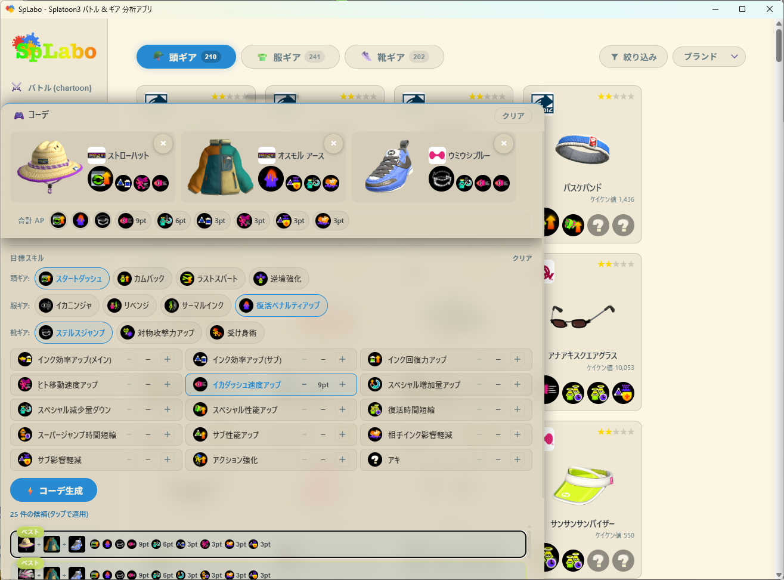

# splabo

[日本語 README](README.md)

An open-source Windows / macOS app that fetches Splatoon 3 battle history and owned gear via the unofficial API reverse-engineered by [nxapi](https://github.com/samuelthomas2774/nxapi) (Nintendo Account), then visualizes and analyzes it. The official app only keeps the last 50 battles; splabo stores every battle it fetches in a database on this PC. Not affiliated with Nintendo Co., Ltd.

> ## 📢 chartoon is now splabo
>
> - The battle visualization app **chartoon** merged with the gear manager **geartoon** into **splabo**, a single binary (`com.splabo.app`).
> - The **Gear** tab fetches, browses, and builds loadouts (the former geartoon features).
> - **Settings, battle data, and gear data carry over.** Data from the old `com.chartoon.app` / `com.geartoon.app` apps is copied non-destructively on first launch (`app/src-tauri/src/migration.rs`).

Bug reports, feature requests, and feedback are welcome via the [feedback form](https://docs.google.com/forms/d/e/1FAIpQLSd2m8eNn4HwTjOY1PMnecJvSH95QCJxNi0Lyy1w4zxhIdndrQ/viewform) (anonymous OK).

🌐 **Download page**: [https://splaboon.pages.dev/en/](https://splaboon.pages.dev/en/) ([日本語](https://splaboon.pages.dev/))

```
splabo/
├─ app/          # Tauri app (Vite + React + recharts + Rust/SQLite)
│  ├─ src/       #   frontend (battle components/ + gear gear/ with .gear-root scope)
│  └─ src-tauri/ #   Rust (auth / statink / gear.rs / gear_crypto.rs / migration.rs / companion.rs / battle_export.rs + SQLite)
├─ tools/        # nxapi sidecar build (nxapi-wrapper)
├─ docs/         # GitHub Pages (splaboon.pages.dev)
├─ .github/      # CI (ci.yml) + release (splabo-release.yml)
├─ package.json  # npm workspaces (app)
└─ Cargo.toml    # Cargo workspace + [workspace.dependencies]
```

## Features

- **Battles** — switch between Dashboard and List in the tab. The official app only keeps the last 50 battles; every battle splabo fetches is stored in a database on this PC
  - Dashboard: win-rate charts by weapon, lobby, and stage. Battle-count calendar (a new column starts on the 1st of each month) and custom charts
  - List: paginated battle history. Detail modal shows team composition, gear, rank / X Power changes
- **Weapons** — Panel and List views. List columns sort on header click; filter by category / sub / special. Official-app records (freshness, total wins, total turf inked, Challenge Power) are available. Detail shows frequently played stages, high win-rate stages, and per-mode win rates
- **Stages** — Panel and List views. Your stats plus official-app all-time win rates by mode
- **Gear loadouts** — fetch owned gear and combine abilities into loadouts (former geartoon)
- **Meta analysis** — import public [stat.ink](https://stat.ink/) battles and analyze community pick rates and win rates with scatter plots and matrix heatmaps. Import start date is under Settings → Data (default: 2025-01-01 onward). Filter by period, lobby, mode, weapon (select by category heading), stage, version, and rank band (all-time / current season / 1 year / 180 days / 30 days / custom). Matching battle count is shown. Aggregation matches stat.ink overall stats: the other 7 players (excluding the uploader)
- **stat.ink auto-upload** — upload fetched battles to [stat.ink](https://stat.ink/) when an API key is set. The same UUID v5 namespace as s3s deduplicates identical battles
- **Save panels** — save Dashboard and Meta Analysis panels as **PNG** or **HTML** (button at the top-right of each panel). Images/HTML include title, filters, the splabo logo, and credit. PNG keeps pixels outside rounded corners transparent. Open HTML in a browser to hover scatter tooltips; weapon-icon scatter plots still spread overlapping points
- **AI analysis** — ask in natural language; SQL is generated and **aggregated only on this PC**, then shown as tables/charts (OpenAI / Google Gemini / Anthropic Claude / xAI Grok)
- **Auto-fetch** — fetch battles in the background every 15 minutes–24 hours, then update gear (a gear failure does not undo a successful battle fetch). When enabled, closing the window leaves a tray icon; completion is a system notification. Default is every hour (see [Fetch interval and auth](#fetch-interval-and-auth))

> **About filters**: Weapons and Stages also follow the top filters (period, lobby, mode, result). Official-app freshness, total wins, turf inked, Challenge Power, and stage all-time win rates are all-time values, so changing filters does not change them. Dashboard chart axes can use these official values too.

## Screenshots

<table>
  <tr>
    <th>Dashboard</th>
    <th>Gear loadouts</th>
    <th>Meta analysis</th>
  </tr>
  <tr>
    <td></td>
    <td></td>
    <td></td>
  </tr>
  <tr valign="top">
    <td>Analyze battle results on the dashboard</td>
    <td>Generate loadouts from target abilities</td>
    <td>Analyze the meta from public stat.ink data</td>
  </tr>
</table>

## Requirements

| Tool           | Use                                      |
| -------------- | ---------------------------------------- |
| Node.js 20+    | App development and build                |
| Rust + Cargo   | Tauri desktop app build                  |

Windows / macOS (no WSL). Linux is untested.

---

## Build

npm workspaces + Cargo workspace. Install frontend deps **once at the repo root**.

```bash
# Install deps (whole workspace at the root)
npm ci

# Frontend (tsc + vite build)
npm run build -w app

# Rust (workspace typecheck)
cargo check
```

### Sidecar (nxapi-wrapper)

The Tauri backend requires `app/src-tauri/binaries/nxapi-sidecar` as an externalBin. Build the sidecar before a local or release build (platform scripts: `build:win` / `build:mac-arm` / `build:linux`).

```bash
cd tools/nxapi-wrapper
npm install
./build.sh mac-arm    # macOS Apple Silicon
# ./build.sh mac-x64  # macOS Intel
# build.bat           # Windows
```

### Dev

```bash
npm ci                     # once at the repo root
npm run tauri dev -w app   # first run compiles Rust and takes a few minutes
```

> **macOS note**: `tauri dev` may not handle Nintendo login deep-links (`npf71b963c1b7b6d119://`) correctly. For login, use the `.app` from `npx tauri build`.

## Local installer

```bash
cd app
npx tauri build    # produces an installer (first run is a full Rust build)
```

Output is under `app/src-tauri/target/release/bundle/` (Windows: `.msi` / `.exe`, macOS: `.dmg`).

## Release

Pushing a single `splabo-vX.Y.Z` tag runs `.github/workflows/splabo-release.yml` and creates a draft release (Windows `.exe` / `.msi`, macOS `.dmg`). Changelog continues in [`CHANGELOG.md`](CHANGELOG.md) (Japanese). Old per-app tags (`chartoon-v*` / `geartoon-v*`) and pre-monorepo `vX.Y.Z` are frozen and not workflow triggers.

---

## Technical notes

### What is SplatNet 3?

**SplatNet 3** is Nintendo’s service used internally by the Nintendo Switch Online smartphone app. It has a GraphQL API for battle history, gear, and more, but it is not a public API.

[**nxapi**](https://github.com/samuelthomas2774/nxapi) (OSS by samuelthomas2774) reverse-engineered this flow so third-party tools can reach SplatNet 3. splabo’s auth is that nxapi flow reimplemented in Rust.

Persisted GraphQL query names and hashes come from the same author’s [splatnet3-types](https://github.com/nintendoapis/splatnet3-types) (GitLab mirror). Official weapon records and stage win rates from SplatNet 3 app v10 onward use **WeaponQuery** / **StageRecordQuery** instead of the old `WeaponRecordQuery`.

### Auth

Nintendo Switch Online (NSO) OAuth2 (PKCE) is implemented in Rust (`app/src-tauri/src/auth.rs`), following the nxapi-documented flow. f-tokens are generated via the `nxapi-znca-api.fancy.org.uk` endpoint that nxapi uses internally.

Auth flow (as reverse-engineered by nxapi):
```
Nintendo Account login URL → open in browser (authorization code via deep-link)
→ session_token (long-lived)
→ id_token → f-token (nxapi-znca-api) → Coral login → gtoken
→ bulletToken (SplatNet 3 access, ~2 hours)
```

### Fetch interval and auth

**Longer auto-fetch intervals are worse.** That is why the default is 1 hour.

bulletToken expires after about 2 hours. After expiry, every fetch re-authenticates, and auth is the flakiest step. It is about 12 round-trips; f-token generation goes through external `nxapi-znca-api` (which sometimes returns `500 {"error":"timeout"}`).

| Interval | Token                         | Auth                         |
| -------- | ----------------------------- | ---------------------------- |
| 120 min  | Expired on every fetch        | **Every time**               |
| 60 min   | Alive on every other fetch    | **About half as often**      |

nxapi also rate-limits auth by kind (`na` / `coral` / `splatnet3`) to **4 per hour**, and **failed attempts count**. Hitting a long interval during an upstream outage can lock you out for an hour after a few failures.

A shorter interval than token lifetime hits the cache more often and authenticates less. When the rate limit is reached, the app **stops before attempting auth** (so it does not burn more slots) and does not send a failure notification (waiting is the only option). Logs show the recovery time.

### Data storage

Battle data is stored in SQLite (`chartoon.db`).
Main fields (mode, weapon, stage, K/D/A, turf, etc.) are columns; the full response is in `raw_json`. Owned gear is stored as encrypted JSON (gear-export-v1).

### AI analysis

OpenAI / Google Gemini / Anthropic Claude / xAI Grok are used in **two stages**. **All numbers are computed by local SQLite; the AI does not invent numbers.**

| Stage | Role | Sent to the AI |
| ----- | ---- | -------------- |
| ① Write SQL | What to aggregate | The question, schema notes (view defs and domain knowledge), row counts and date range. **Not battle contents** |
| App | Aggregate | (nothing sent; local read-only, timeout, row cap) |
| ② Choose presentation | Table vs chart, rows, columns, cells, axes | The question, column names, **first 20 aggregated rows** (stage names, weapon names, win rates, …) |
| App | Build table/chart | (nothing sent; pivot/cell formatting and series mapping in Rust `ai_present`) |

② only specifies which columns are rows or axes; **it does not touch numbers**. The app builds the shape, so a sloppy AI layout still renders. Bar, line, and scatter are supported; otherwise it falls back to a table.

The UI shows the AI’s explanation, the SQL, the table or chart, and the raw aggregate. Each provider has priced model presets (`app/src/utils/aiModels.ts`). API keys live in `localStorage`.

### stat.ink upload

[**stat.ink**](https://stat.ink/) is an OSS platform for sharing and analyzing Splatoon 3 battles. With an API key, splabo can auto-upload fetched battles to `stat.ink/api/v3/battle`.

Payload construction is a Rust reimplementation of [**s3s**](https://github.com/frozenpandaman/s3s) (`prepare_battle_result` / `set_scoreboard` equivalents in `app/src-tauri/src/statink.rs`). UUID v5 namespace for battle IDs matches s3s so the same battle from another tool is deduplicated. Weapon/stage ID mapping is also from s3s.

- Endpoint: `https://stat.ink/api/v3/battle`
- Payload: battle result (mode, rule, stage, K/D/A, turf), both teams’ weapons and abilities, rank / X Power history (Anarchy Challenge and X Battle series finals only)
- API key: stored only locally (AppData). Get one from stat.ink’s [API token page](https://stat.ink/profile)
- Trigger: when auto-upload is ON in Settings, unsent battles are uploaded after a fetch

---

## Notes

- This tool is intended for personal use.
- SplatNet 3 is not a public Nintendo API. Nintendo-side changes may break it without notice.
- Credentials are stored only in the app’s AppData directory (Windows: `%APPDATA%\com.splabo.app\`, macOS: `~/Library/Application Support/com.splabo.app/`). Data from old chartoon / geartoon is copied non-destructively on first launch. Do not commit it.
- The in-app UI is Japanese-only for now (English UI is planned).

## Privacy policy

Information this tool collects and uses:

### Collected

- **Nintendo Account session token (`session_token`)**
  - Stored only in the local AppData directory.
  - Never sent or uploaded to an external server by splabo itself.
- **Battle history**
  - Battles fetched from SplatNet 3 are stored only in the local SQLite DB.

### Sent to third parties

- **nxapi-znca-api (`nxapi-znca-api.fancy.org.uk`)**: during Nintendo auth, `id_token` is sent to this endpoint so nxapi can mint an f-token. This is nxapi’s flow, not a splabo-specific upload. See [nxapi](https://github.com/samuelthomas2774/nxapi).
- **stat.ink (`stat.ink/api/v3/battle`)**: only if you register an API key and enable auto-upload. Unsent battles are uploaded after a fetch. Payload is battle results, both teams’ weapons/abilities, and rank / X Power history. The API key stays in local AppData and is not sent anywhere except stat.ink. Turn the setting OFF to stop uploads.
- **AI APIs (OpenAI / Gemini / Anthropic / Grok)**: when you use AI analysis, two requests go to the selected provider.
  - **① Write SQL**: the question and schema notes (view defs, domain knowledge, counts and date range). **Not battle contents.**
  - **② Choose table/chart layout**: the question, column names, and the **first 20 aggregated rows**. Includes aggregated values such as stage names, weapon names, win rates, and counts (not individual battles or other players’ names).
  - API keys stay in local `localStorage` and are not sent to any other provider. If you never use AI analysis, none of this is sent.
- splabo does not otherwise send data out on its own.

### Personal information

This tool does not collect, store, or send names, email addresses, location, or similar personal information.

## Related projects

Used while implementing Nintendo Switch Online auth, SplatNet 3 access, and stat.ink upload:

- [samuelthomas2774/nxapi](https://github.com/samuelthomas2774/nxapi) — Nintendo Switch Online auth and API library (samuelthomas2774; GitHub mirrors GitLab [`samuel/nxapi`](https://gitlab.fancy.org.uk/samuel/nxapi)). splabo auth follows this project’s documented flow. f-tokens use the same endpoint (`nxapi-znca-api.fancy.org.uk`).
- [nintendoapis/splatnet3-types](https://github.com/nintendoapis/splatnet3-types) — TypeScript types for SplatNet 3 / splatoon3.ink by the same author (GitLab [`samuel/splatnet3-types`](https://gitlab.fancy.org.uk/samuel/splatnet3-types)). Source of persisted query names and hashes. v10 official weapon/stage records use `WeaponQuery` / `StageRecordQuery`.
- [fetus-hina/stat.ink](https://github.com/fetus-hina/stat.ink) — OSS for AIZAWA Hina’s Splatoon battle stats platform ([stat.ink](https://stat.ink/)). splabo’s upload uses the public `api/v3/battle` API.
- [frozenpandaman/s3s](https://github.com/frozenpandaman/s3s) — Python tool that sends SplatNet 3 battles to stat.ink. splabo’s upload is a Rust reimplementation of its payload logic (`prepare_battle_result` / `set_scoreboard` equivalents), UUID v5 namespace, and weapon/stage ID mapping.

## Disclaimer

This software is provided under the MIT License with no warranty. See [`LICENSE`](LICENSE).

This project is not affiliated with or endorsed by Nintendo. "Splatoon" is a trademark of Nintendo Co., Ltd.

## License

[MIT](LICENSE)
